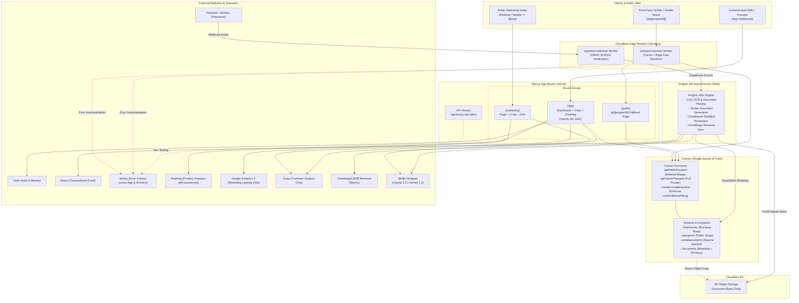

# AI Business Passport - System Architecture

AI Business Passport is Nigeria's AI-powered business operating system. It provides founders and SMEs with a single source of truth ("The Business Brain") to register, remain compliant, generate professional documentation, win tenders, and publish a verifiable identity (The Business Passport).

---

## System Architecture & Wiring Map

The following Mermaid diagram represents the complete end-to-end system topology across clients, Next.js App Router on Vercel, Convex backend, Cloudflare Workers, Inngest async workers, and external third-party integrations:

---

## Core Architectural Guarantees

1. **Business Brain (Single Source of Truth)**:
   - Data entered once by the business owner is reused across all profiles, generated documents, and passport cards.
2. **Source-Backed AI**:
   - Every compliance item carries `source`, `lastReviewedAt`, `effectiveDate`, `confidence`, and `confirmBeforeFiling`.
   - Low confidence (< 0.85) automatically forces `confirmBeforeFiling = true` via database mutation logic.
3. **Privacy by Design**:
   - The public resolver query (`getPublicPassport`) filters fields at the Convex database layer.
   - Client applications never receive unneeded sensitive owner fields (such as NIN, BVN, turnover, bank account numbers).
4. **Clean Provider Isolation**:
   - LLMs are invoked strictly through `/lib/llm` adapters, ensuring zero vendor lock-in between Anthropic and Google Gemini.
5. **Separation of Work**:
   - Next.js serverless functions never run long-running tasks. All OCR, PDF generation, and external syncs execute reliably in Inngest background workers.
